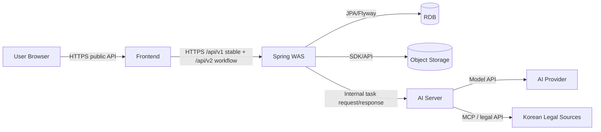

# Target System Architecture

- Status: TARGET_CANONICAL
- Code Baseline Commit: e16bd316ac881f4c5fab076e65c14657f6a8c7d4
- Document Phase: P1
- Introduced In Commit: 1549a8efa0aeb2ca400f4795c1c44b34868e4722
- Scope: Target components, communication and responsibility matrix
- Supersedes: Legacy as-built architecture documents
- Implementation Status: NOT_STARTED

## Target topology

Frontend와 AI Server 사이, AI Server와 RDB/Object Storage 사이에는 연결이 없다.

## Responsibility matrix

| Responsibility | Frontend | Spring WAS | RDB | Object Storage | AI Server |
|---|---|---|---|---|---|
| 사용자 interaction | Own | Serve API | — | — | — |
| 인증·인가·owner scope | Token consumer | Own | Persist state | — | — |
| Workflow/TaskRun state | Display | Source of truth | Persist | — | Execute request only |
| Domain validation | Client hints | Own | Constraints | — | AI-output shape contribution |
| Structured business data | — | Own | Store | — | No access |
| File/binary lifecycle | Upload via Spring | Own | Metadata | Bytes | No access |
| Agent/MCP/model/prompt | — | Request task | — | — | Own |
| AI result validation/adoption | Display | Own | Persist | Persist binary | Produce result |
| Audit/policy | Display/admin | Own | Persist | — | Health/error only |

## Allowed communication

- Browser/Frontend → Spring public API
- Spring → RDB through JPA/Flyway
- Spring → Object Storage through Spring-owned adapter
- Spring → AI Server internal API
- AI Server → configured model provider, Korean legal MCP and 법제처 API
- Spring → AI Server health/readiness

## Forbidden communication

- Frontend → AI Server, RDB or Object Storage direct
- AI Server → RDB or Object Storage direct
- AI Server → presigned GET/PUT URL
- AI Server local file persistence of business artifacts
- Spring domain service → AI provider direct
- external provider response → RDB/Storage without Spring validation

## Current versus Target

현재 Spring에는 provider 직접 adapter 4개와 AnalysisJob 중심 legacy workflow가 있다. FastAPI에는 presigned artifact GET/PUT과 local outputs 코드가 있다. 현재 frontend에는 legacy Workflow API/route가 있다. Target은 TaskRun, /api/v2, Spring-mediated input/result와 persisted Final Report로 이를 교체한다. 이 문서는 해당 변경이 구현됐음을 뜻하지 않는다.
