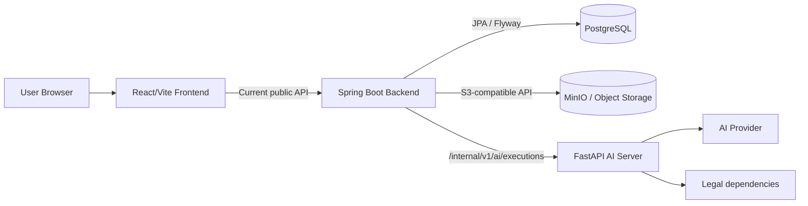

# System Architecture

- Status: CURRENT_AS_BUILT
- Baseline date: 2026-08-04
- Scope: 현재 runtime topology와 서비스 책임

## Current topology

Frontend는 Spring Controller를 호출하며 FastAPI를 직접 호출하지 않는다. Spring은 업무 RDB, 사용자/Project 경계, Object Storage, TaskRun/TaskAttempt/TaskResult 및 결과 채택의 source of truth다. FastAPI는 내부 execution request를 검증하고 task dispatcher를 통해 AI·법률 실행 결과를 반환한다.

## Current official Journey boundary

`Idea → AI 해석 → Idea Origin 보완·확정 → Legal Precheck → Legal Guardrail → Concept 생성 → Origin Integrity → Concept Legal Validation → 적격 Concept 3개 표시`

이후 Concept 분석·선택·Persona·Interview·Marketing·Report는 보존된 기존 MVP 실험 기능이며 현재 Journey와 공식적으로 자동 연결하지 않는다.

## Execution topology

TaskRun 기반이라는 공통점은 있지만 실행기는 현재 혼합되어 있다.

- Legal: Persistent Worker가 claim/start/execute/adopt
- Concept: in-memory Executor가 eligibility batch를 실행하고 내부에서 TaskRun을 claim/execute/adopt
- 일부 Journey: Service 요청 흐름 안에서 동기 claim/execute/adopt

모든 방식을 일괄 202/Polling으로 바꾸지 않는다. Spring의 `InternalAiExecutionClient`가 공통 response identity와 canonical hash를 검증하고, 각 Service/Worker가 domain invariant를 추가 검증한다.

## Data and migration boundary

Flyway V1~V36을 사용하며 V5와 V10은 Java Migration이다. 기존 Migration은 전부 유지한다. 새로운 데이터 변경이 필요하면 후속 작업에서 새 Migration으로만 수행한다.

## API and CI status

Public API의 현재 실행 권위는 실제 Controller와 Frontend Client다. 목표 Public API 계약/OpenAPI 정합화는 별도 후속 작업이다.

현재 작업 트리에는 `.github/workflows`가 없으며 repository-local GitHub Actions는 `NOT_PRESENT`다. 외부 CI는 이 문서에서 단정하지 않는다.
