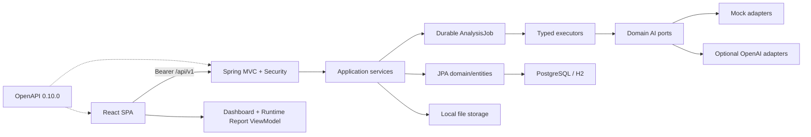

# As-built architecture

- Status: Current
- Verified HEAD: `fd30d55856dd3f266abadea79232c834358abc91`
- Verified Date: 2026-07-24
- Owners: Platform architecture
- Related Source: `backend/src/main`, `frontEnd/src`
- Supersedes: architecture snapshots through Phase 10
- Known Limitations: deployment topology is local/single-node oriented

The architecture deliberately remains a modular monolith. Controller → application service → repository/entity is the common path; controllers do not call AI or repositories directly. DTOs isolate entity persistence from the API.

Cross-cutting ownership:

- Security: Spring Security JWT and project-owner 404 semantics.
- Transactions: application/persistence services; asynchronous execution starts from persisted jobs.
- Jobs: `AnalysisJob` is the source of truth, not frontend timers.
- AI: typed domain DTOs surround provider transport; provider raw responses are not persisted.
- Data: additive Flyway migrations and Hibernate validation.
- UI: `app/features/pages/shared`; API and auth session are centralized.
- Report: frontend-only current-state aggregation; no report persistence, job, AI, or endpoint.

See the backend, frontend, job, AI, and data documents for extension constraints.
