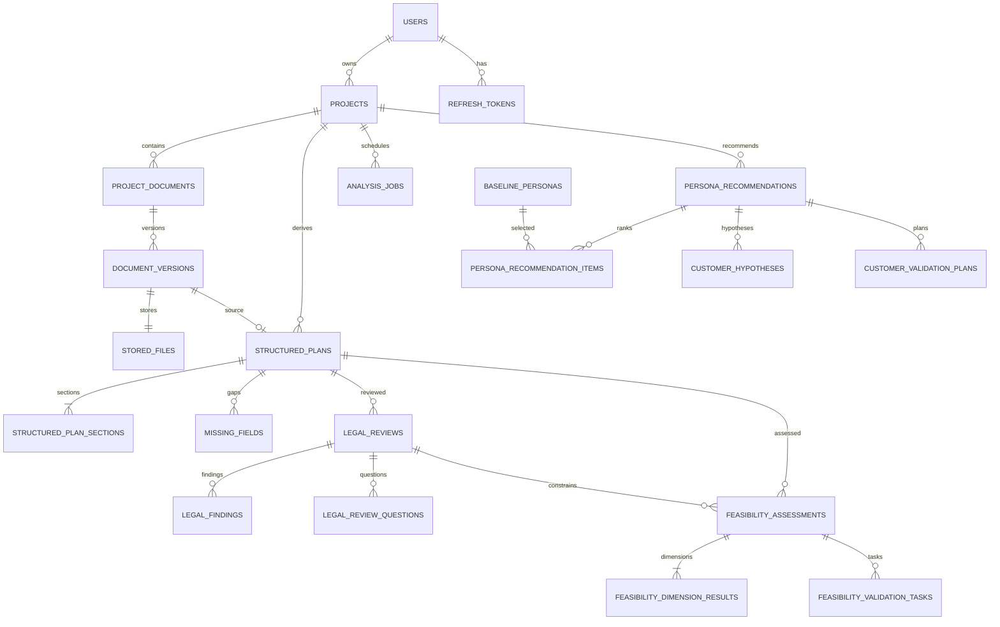

# Current ERD

- Status: Current
- Verified HEAD: `bea5d38f15209d488a95cc1d156c17dfead30e1e`
- Verified Date: 2026-07-24
- Owners: Backend/Data
- Related Source: Flyway V1–V9
- Supersedes: external `erDiagram.md` for As-built use
- Known Limitations: legacy/reserved V2 tables are summarized separately

`analysis_jobs` references one of document version, structured plan, legal review, or feasibility assessment according to JobType. Database constraints cover FK/uniqueness; Java invariants enforce the matching source combination.

Legacy V2: persona instance/prompt/project links → simulations → rounds/questions/responses/discussions/insights/predictions; reports → versions/sources/files; marketing materials → assets/variants.
