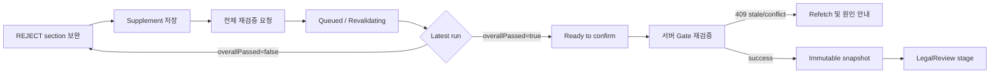

# Phase D1 사업계획서 구조화 API·UX 계약

## 1. 범위와 공통 원칙

- 기준 commit: `8283acb5889e800a8fad5f59e354c247c09aac68`
- 외부 base path: `/api/v1`
- 기존 `ApiResponse` envelope, 인증, project 권한, upload/list/version/job/latest-plan/confirm URL을 유지한다.
- JSON 외부 필드명은 기존과 같이 `camelCase`다.
- Spring이 authorization, optimistic lock, active Job, 최신 DocumentVersion, latest ValidationRun과 confirmation Gate를 최종 판정한다.
- Frontend의 비활성화와 route guard는 안내 수단이며 보안 또는 업무 Gate를 대체하지 않는다.

공통 오류 envelope:

```json
{
  "success": false,
  "error": {
    "code": "VALIDATION_RESULT_STALE",
    "message": "최신 보완값에 대한 재검증이 필요합니다.",
    "fieldErrors": [],
    "retryable": false,
    "correlationId": "correlation-id"
  }
}
```

## 2. 권한 모델

| 동작 | 최소 권한 | 추가 조건 |
|---|---|---|
| 문서/plan/run/evidence 조회 | project member read | project 소속 resource |
| 업로드 | project editor | 업로드 가능한 project stage |
| supplement 저장 | project editor | plan editable, CONFIRMED/SUPERSEDED 아님 |
| 재검증 | project editor | 최신 document 기반 plan, active parse job 없음 |
| 확정 | project owner 또는 confirm 권한 | latest run이 latest successful run과 동일하고 전체 PASS |
| 후속 단계 진입 | 해당 분석 실행 권한 | confirmed snapshot 존재 |

다른 project의 ID를 주었을 때 resource 존재 여부를 노출하지 않도록 `404`를 반환한다.

## 3. 유지하는 기존 API

실제 route에는 모두 `/api/v1`이 붙는다.

### 3.1 `POST /projects/{projectId}/documents`

- request: `multipart/form-data`
  - `file`: DOCX
  - `documentType`: 기존 enum
  - header `Idempotency-Key`: 필수 UUID
- response: `202 Accepted`

```json
{
  "projectId": "uuid",
  "documentId": "uuid",
  "versionId": "uuid",
  "jobId": "uuid",
  "status": "QUEUED"
}
```

- 동일 key와 동일 normalized request는 최초 응답을 재생한다. 다른 파일/metadata면 `409 IDEMPOTENCY_CONFLICT`.
- 업로드는 현재 document의 새 `DocumentVersion`과 새 `StructuredPlan` 계보를 만든다.
- 기존 active `DOCUMENT_PARSE`가 있으면 정책상 병렬 version 업로드를 막고 `409 ANALYSIS_ALREADY_RUNNING`을 반환한다.
- 주요 오류: 기존 file 오류, `DOCUMENT_UPLOAD_NOT_ALLOWED`, `OBJECT_STORAGE_UNAVAILABLE`, `ANALYSIS_ALREADY_RUNNING`.

### 3.2 `GET /projects/{projectId}/documents`

- response: `200 OK`, 기존 document list DTO 유지.
- 각 item의 `documentId`, `type`, `currentVersion`, `status`, `latestVersionId`, `updatedAt`을 유지한다.
- parser/validation 확장 정보가 필요하면 optional additive field로만 추가한다.
- read API이므로 idempotency key와 optimistic lock은 없다.

### 3.3 `GET /documents/{documentId}/versions/{versionId}`

- response: `200 OK`, 기존 file name/size/parseStatus/uploadedAt 유지.
- additive 후보: `parserVersion`, `parserArtifactStatus`, `blockCount`, checksum은 권한 있는 내부 진단 사용자에게만 노출한다.
- document-version 소속이 다르면 `404 DOCUMENT_VERSION_NOT_FOUND`.

### 3.4 `GET /jobs/{jobId}`

- response: `200 OK`, 기존 `JobResponse` 필드를 유지한다.
- `jobType=DOCUMENT_PARSE`의 target additive field:

```json
{
  "validationRunId": "uuid",
  "step": "PARSING",
  "resultRefType": "STRUCTURED_PLAN_VALIDATION_RUN",
  "resultRefId": "uuid"
}
```

- `step`: `QUEUED`, `PARSING`, `EVALUATING`, `PERSISTING`.
- 초기 분석은 parser artifact가 없으므로 `PARSING → EVALUATING → PERSISTING`이다.
- 같은 plan 재검증은 기존 parser artifact의 존재와 checksum을 검증한 뒤 `PARSING`을 생략하고 `EVALUATING → PERSISTING`으로 진행한다. 재검증마다 DOCX를 다시 parse하지 않는다.
- section REJECT가 있어도 Job은 `SUCCEEDED`; 업무 결과는 ValidationRun의 `overallPassed=false`다.

### 3.5 `GET /projects/{projectId}/jobs/latest?jobType=DOCUMENT_PARSE`

- response: `200 OK` 최신 Job 또는 현재 계약의 no-content/not-found 의미를 유지한다.
- Frontend 새로고침 recovery의 기준이다.
- 여러 run을 보여 주는 history API로 사용하지 않는다.

### 3.6 `GET /projects/{projectId}/structured-plans/latest`

- response: `200 OK`; 기존 plan, 12 sections, missingFields, version/provenance를 유지하고 다음을 additive로 추가한다.

```json
{
  "planId": "uuid",
  "version": 7,
  "status": "NEEDS_INPUT",
  "sourceDocumentVersionId": "uuid",
  "rubricVersion": "business-plan-rubric-v2",
  "latestValidationRun": {
    "validationRunId": "uuid",
    "status": "SUCCEEDED",
    "overallPassed": false,
    "supplementRevision": 3,
    "completedAt": "2026-07-31T10:00:00Z"
  },
  "latestSuccessfulValidationRunId": "uuid",
  "supplementRevision": 3,
  "sections": [],
  "legacy": false
}
```

- `sections`는 정확히 12개 canonical 순서다.
- 기존 `completionRate`는 legacy 표시 호환 필드이며 confirmation 판단에 쓰지 않는다.
- `latestValidationRun`은 상태와 무관하게 run number가 가장 큰 실행이다. `latestSuccessfulValidationRunId`는 가장 최근 SUCCEEDED 실행이며 최신 run이 FAILED/RUNNING이면 서로 다를 수 있다.
- latest plan은 project의 최신 active DocumentVersion에서 파생된 plan이다. 과거 plan은 별도 ID 조회가 구현되기 전 history에서만 참조한다.

### 3.7 `POST /projects/{projectId}/structured-plans/{planId}/confirm`

기존 URL을 유지한다.

```json
{
  "version": 7,
  "validationRunId": "uuid"
}
```

- `version`: 기존 optimistic lock 필수 값.
- `validationRunId`: 신규 client는 필수로 보낸다. 전환 기간의 기존 client가 생략하면 서버가 latest successful run을 resolve하되 모든 Gate는 동일하게 검사한다.
- response: `200 OK`, 기존 confirmed plan DTO에 `confirmedSnapshotId`, `confirmedValidationRunId`를 additive로 반환한다.
- transaction은 plan row를 lock하고 최신 DocumentVersion, supplement revision, 정확히 12개, provider/mock 정책을 재검증한다. 이때 latest run은 SUCCEEDED이고 latest successful run과 동일하며 overallPassed=true여야 하고, 그 뒤 supplement/parser/source 변경이 없어야 한다.
- 성공 시 snapshot 생성, plan `CONFIRMED`, project `LEGAL_REVIEW` 전이를 원자적으로 수행한다. LegalReview Job은 자동 생성하지 않는다.
- 같은 plan, 같은 validationRun, 같은 snapshot identity의 재요청은 `200 OK`로 기존 confirmed plan/snapshot response를 반환한다.
- snapshot이 이미 있는데 다른 validationRun으로 확정하려는 요청은 `409 CONFIRMATION_ALREADY_EXISTS`다.
- 충돌/오류:
  - `409 RESOURCE_VERSION_CONFLICT`
  - `409 DOCUMENT_VERSION_STALE`
  - `409 VALIDATION_RESULT_STALE`
  - `409 PLAN_NOT_READY_TO_CONFIRM`
  - `409 LATEST_VALIDATION_NOT_PASSED`
  - `409 CONFIRMATION_ALREADY_EXISTS`
  - `422 INVALID_VALIDATION_CONTRACT`

## 4. Supplement API

### 4.1 확정 endpoint

`PUT /projects/{projectId}/structured-plans/{planId}/sections/{sectionCode}/supplement`

PUT을 canonical 계약으로 사용한다. 기존 missing-field PATCH는 전환 adapter로 유지하되 같은 command service와 revision 규칙을 사용한다.

```json
{
  "content": "부족한 내용을 보완하는 사실과 근거",
  "version": 2,
  "planVersion": 7
}
```

response `200 OK`:

```json
{
  "supplementId": "uuid",
  "sectionCode": "MARKET_SIZE",
  "content": "부족한 내용을 보완하는 사실과 근거",
  "version": 3,
  "planVersion": 8,
  "supplementRevision": 4,
  "validationRequired": true,
  "updatedAt": "2026-07-31T10:10:00Z"
}
```

- section별 active supplement의 전체 값을 교체한다. 동일 값과 동일 version 재전송은 현재 representation을 반환한다.
- 빈 content는 supplement 삭제 의미로 사용하지 않는다. 삭제가 필요하면 별도 `DELETE` 후보를 D2에서 구현하거나 명시적 `clear=true` 계약을 새 schema version에서 추가한다.
- 길이: trim 후 1~20,000자.
- 저장 성공 시 plan의 `supplementRevision`과 lock `version`이 증가하고 plan은 `NEEDS_INPUT`이 된다.
- 저장만으로 section status를 PASS로 변경하거나 `effectiveContent`를 갱신하지 않는다.
- active validation Job이 있어도 해당 run 입력은 immutable하다. 혼동을 막기 위해 저장을 `409 VALIDATION_ALREADY_RUNNING`으로 막는다.
- 오류: `404 STRUCTURED_PLAN_NOT_FOUND`, `404 SECTION_NOT_FOUND`, `409 RESOURCE_VERSION_CONFLICT`, `409 PLAN_NOT_EDITABLE`, `409 VALIDATION_ALREADY_RUNNING`, `422 SUPPLEMENT_INVALID`.

### 4.2 기존 PATCH 호환

`PATCH /projects/{projectId}/structured-plans/{planId}/missing-fields/{missingFieldId}`

- 기존 FILLED payload는 새 supplement command로 변환한다.
- 신규 WAIVED 요청은 `422 WAIVER_NOT_ALLOWED`.
- legacy WAIVED row는 읽을 수 있지만 수정·재생성할 수 없다.
- response에는 기존 필드를 유지하고 `supplementRevision`, `validationRequired`를 additive로 제공한다.

## 5. Revalidation API

### 5.1 생성

`POST /projects/{projectId}/structured-plans/{planId}/validation-runs`

header `Idempotency-Key`는 필수 UUID다.

```json
{
  "planVersion": 8,
  "expectedDocumentVersionId": "uuid",
  "supplementRevision": 4
}
```

response `202 Accepted`:

```json
{
  "validationRunId": "uuid",
  "jobId": "uuid",
  "status": "QUEUED",
  "overallPassed": null,
  "planId": "uuid",
  "documentVersionId": "uuid",
  "supplementRevision": 4
}
```

- 재검증은 항상 전체 12개 section을 평가한다.
- 같은 plan, documentVersion, supplementRevision, rubricVersion에 대해 active run은 하나뿐이다.
- 동일 idempotency key/request는 기존 run/job을 반환한다.
- active Job 충돌은 `409 VALIDATION_ALREADY_RUNNING`과 기존 job/run ID를 details에 반환한다.
- stale plan/version/revision은 각각 `RESOURCE_VERSION_CONFLICT`, `DOCUMENT_VERSION_STALE`, `SUPPLEMENT_REVISION_STALE`.
- parser artifact가 준비되지 않았으면 `409 PARSER_ARTIFACT_NOT_READY`; 유실/무결성 오류면 `422 PARSER_ARTIFACT_INVALID`.

### 5.2 단건 조회

`GET /projects/{projectId}/structured-plans/{planId}/validation-runs/{validationRunId}`

- response `200 OK`.
- 상태, Job ID, request/version hash, provider/model/version, overallPassed, 정확히 12개 section validation(성공 시), error와 timestamps를 반환한다.
- QUEUED/RUNNING은 `overallPassed=null`, `itemResults=[]`.
- FAILED는 안전한 error code/message를 반환하고 provider raw response는 노출하지 않는다.
- 다른 plan의 run ID는 `404 VALIDATION_RUN_NOT_FOUND`.

### 5.3 이력 조회

`GET /projects/{projectId}/structured-plans/{planId}/validation-runs?limit=20&cursor=...`

- response `200 OK`, 최신순 cursor pagination.
- `limit` 기본 20, 최대 100.
- 각 item은 run status, overallPassed, supplementRevision, rubric/prompt/provider/model, started/completed, jobId를 포함한다.
- section 전문은 단건 조회에서만 반환한다.

## 6. Evidence preview API

`GET /projects/{projectId}/structured-plans/{planId}/validation-runs/{validationRunId}/sections/{sectionCode}/evidence/{blockId}`

response `200 OK`:

```json
{
  "documentVersionId": "uuid",
  "parserVersion": "spring-docx-blocks-v2",
  "blockId": "b-000004",
  "sequence": 4,
  "type": "PARAGRAPH",
  "text": "근거 원문",
  "location": {
    "bodyElementIndex": 3,
    "paragraphIndex": 2,
    "tableIndex": null,
    "rowIndex": null,
    "columnIndex": null
  },
  "checksumVerified": true
}
```

- run의 section validation에 저장된 evidence ID만 조회할 수 있다.
- Spring이 parser artifact를 Object Storage에서 읽고 checksum을 확인해 해당 block만 반환한다.
- raw DOCX URL이나 장기 presigned URL은 browser에 노출하지 않는다.
- 오류: `404 EVIDENCE_NOT_FOUND`, `409 PARSER_ARTIFACT_UNAVAILABLE`, `422 EVIDENCE_REFERENCE_INVALID`.

## 7. API별 동시성·stale 요약

| API | idempotency | optimistic lock | active Job | stale 처리 |
|---|---|---|---|---|
| upload | header 필수 | 없음 | 병렬 parse 차단 | 새 version 생성 |
| supplement PUT | 값 기준 멱등 | supplement+plan version | 저장 차단 | 409 |
| revalidate POST | header 필수 | plan version+revision | 동일 plan active run 차단 | 409 |
| run/history/evidence GET | 본질적 멱등 | 없음 | 조회 허용 | 명시한 과거 run 조회 가능 |
| confirm POST | 기존 snapshot 재생 | plan version | validation running 차단 | 최신 문서/run/revision 아니면 409 |

## 8. 표준 오류와 UX 매핑

| HTTP/code | 사용자 메시지·동작 |
|---|---|
| 400 `IDEMPOTENCY_KEY_INVALID` | 요청을 다시 시작하고 새 key 사용 |
| 401/403 | 로그인 또는 권한 안내, 편집 action 숨김 |
| 404 resource code | 최신 project 상태를 다시 조회 |
| 409 `RESOURCE_VERSION_CONFLICT` | plan과 section을 refetch하고 편집값은 보존해 재적용 안내 |
| 409 `DOCUMENT_VERSION_STALE` | 최신 업로드 문서 화면으로 이동 |
| 409 `SUPPLEMENT_REVISION_STALE` | 최신 supplement 병합 확인 후 재저장 |
| 409 `VALIDATION_ALREADY_RUNNING` | 반환된 Job으로 polling 복구 |
| 409 `VALIDATION_RESULT_STALE` | 재검증 CTA |
| 409 `LATEST_VALIDATION_NOT_PASSED` | REJECT section으로 이동 |
| 409 `PLAN_NOT_READY_TO_CONFIRM` | Gate 원인을 표시하고 확인 버튼 비활성 |
| 422 parser/evidence/schema 오류 | 재시도만 반복하지 않고 지원용 correlation ID 표시 |
| 429/502/503/504 provider 오류 | retryable이면 Job 재시도 상태 표시, 소진 시 재검증 CTA |

Frontend는 서버 error code로 분기하고 message 문자열을 비교하지 않는다.

## 9. Frontend UX 상태 모델

| UX 상태 | 원장 상태 | 주 action |
|---|---|---|
| `upload` | 업로드 전 또는 문서 없음 | DOCX 선택·업로드 |
| `queued` | Job QUEUED | polling, 취소는 별도 정책 전까지 없음 |
| `parsing` | Job RUNNING + step PARSING | 진행 표시 |
| `evaluating` | Job RUNNING + step EVALUATING/PERSISTING | 진행 표시 |
| `needs input` | latest run SUCCEEDED, overallPassed=false | REJECT section 보완 |
| `revalidating` | 기존 plan의 새 run QUEUED/RUNNING | polling, 편집 잠금 |
| `ready to confirm` | latest run SUCCEEDED, latest successful run과 동일, overallPassed=true, revision/source 최신 | 확정 |
| `confirmed` | plan CONFIRMED + snapshot 존재 | LegalReview CTA |
| `failed` | Job/ValidationRun FAILED | 오류별 retry/reupload/support |

`completionRate=100`은 legacy UI 보조값일 뿐 `ready to confirm`으로 매핑하지 않는다. 준비 상태는 반드시 latest ValidationRun이 latest successful run과 같고 `overallPassed=true`인 경우와 서버 Gate 정보로 계산한다.

### 9.1 Recovery 우선순위

화면 진입 또는 새로고침 시:

1. 최신 document와 source version을 조회한다.
2. 최신 `DOCUMENT_PARSE` Job을 조회한다.
3. active Job이면 해당 상태로 polling한다.
4. Job 성공이면 latest StructuredPlan과 latest ValidationRun을 조회한다.
5. plan source가 최신 document version과 다르면 stale banner를 표시하고 이전 plan을 확정하지 않는다.
6. confirmed snapshot이 있으면 confirmed 상태를 최우선으로 표시한다.

## 10. 12개 section 화면 계약

모든 section card는 canonical 순서와 표시명을 사용하고 다음을 보여 준다.

- AI 검증 status: `PASS` 또는 `REJECT`
- `extractedContent`: 원문에서 추출한 내용
- `effectiveContent`: 최신 성공 run에서 검증 완료된 최종 내용
- `missingDetails`: REJECT에서 필요한 보완 목록
- `reason`: AI 판단 근거
- confidence와 prompt/rubric version은 상세 정보에서 표시
- evidence block 목록과 원문 보기 action
- 현재 supplement 편집값, 저장 version, 마지막 수정 시각

동작 규칙:

- PASS section도 내용을 조회할 수 있으나 보완 편집은 기본적으로 REJECT section에 제공한다.
- supplement 저장 직후 이전 effectiveContent에는 “이전 검증 결과” 표식을 붙인다.
- 여러 section을 보완한 뒤 한 번의 “전체 재검증”으로 정확히 12개를 평가한다.
- REJECT 이유와 missing details가 없으면 client도 contract error로 표시한다.
- evidence 원문 보기는 run에 고정된 parser artifact block을 사용한다.
- WAIVED 또는 “면제” action은 신규 UX에 없다.
- 사업상 비적용은 supplement에 비적용 사실과 근거를 입력하고 AI PASS 검증을 받아야 한다.

## 11. Revalidation과 confirmation 화면 흐름



confirm modal에는 source file/version, validation 완료 시각, rubric version, 12/12 PASS를 보여 준다. stale하거나 active Job이 있으면 확인 버튼을 숨기기보다 비활성화하고 원인을 명시한다.

## 12. 후속 단계 Gate UX

- Legal/Feasibility/Financial/Persona/Marketing/Report route는 `confirmedSnapshotId`를 입력 원장으로 요구한다.
- 현재 Phase 흐름상 confirm 성공은 project stage만 `LEGAL_REVIEW`로 바꾸며 LegalReview Job은 사용자가 별도로 시작한다.
- Frontend route guard는 snapshot 부재 시 구조화 화면으로 안내한다.
- 각 후속 start endpoint는 snapshot 존재, project 소유권, 허용 stage, 필요한 12-section subset과 snapshot checksum을 다시 검증한다.
- `LEGACY_CONFIRMED`이며 snapshot이 없는 plan은 “재검증 필요” banner와 구조화 재개 CTA를 제공하고 새 후속 분석 시작을 막는다.
- 이미 생성된 legacy 분석 결과는 삭제하지 않고 legacy source badge와 provenance를 유지한다.

## 13. Object Storage UX 영향

- browser는 Object Storage credential이나 object key를 직접 다루지 않는다.
- 업로드는 계속 Spring endpoint로 보내고 Spring이 원본을 ObjectStoragePort에 저장한다.
- evidence preview는 Spring이 권한과 artifact checksum을 검증한 최소 block response다.
- 원본 다운로드 기능을 추가할 경우 짧은 만료시간의 별도 권한 endpoint를 사용하며 evidence API와 섞지 않는다.

## 14. 호환성과 폐기 일정

- 기존 URL과 response envelope를 유지하고 신규 필드는 additive/nullable로 먼저 배포한다.
- 기존 `status=PRESENT/MISSING/PARTIAL`, `completionRate`, `missingFields`는 전환 기간 조회 호환용이다.
- 새 client의 표시와 confirm 판단은 ValidationRun의 PASS/REJECT와 `overallPassed`만 사용한다.
- 기존 missing-field PATCH는 supplement PUT으로 내부 위임한다.
- WAIVED write는 신규 rubric에서 즉시 거부하며 legacy row는 read-only다.
- Spring 직접 OpenAI 경로와 LocalFileStorage는 공식 계약에서 제외하되 구현 제거는 후속 Phase에서 한다.

## 15. 구현 수용 기준

- 기존 client가 유지 API의 기존 필드만 사용해도 깨지지 않는다.
- stale document, plan lock, supplement revision, active Job 충돌을 각각 고유 error code로 식별한다.
- 새로고침 후 active Job polling과 finished run 복구가 가능하다.
- supplement 저장만으로 PASS 또는 confirm 가능 상태가 되지 않는다.
- latest 전체 12개 PASS run 외에는 confirm이 서버에서 거부된다.
- confirm 성공과 snapshot/project-stage 변경이 한 transaction이다.
- evidence preview가 run에 없던 block ID나 checksum 불일치를 반환하지 않는다.
