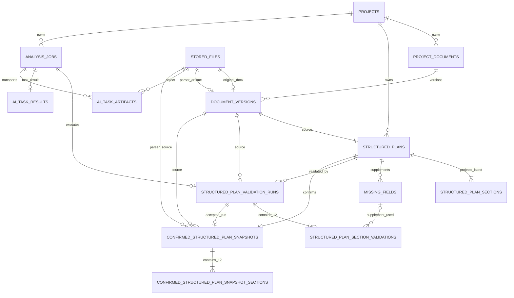

# Phase D1 — 사업계획서 구조화 목표 ERD

## 1. 설계 기준

- 기준 commit: `8283acb5889e800a8fad5f59e354c247c09aac68`
- 관련 계약: `DOCUMENT_STRUCTURE_D1_CONTRACT.md`
- 이 문서는 목표 논리/물리 설계이며 SQL migration은 포함하지 않는다.
- PostgreSQL과 Spring만 데이터 원장이다.
- 기존 테이블과 PK를 최대한 유지한다.
- 원본 DOCX와 parser typed blocks는 object storage에 저장하고 DB에는 `stored_files` 참조와 검증 metadata만 둔다.
- ValidationRun, SectionValidation, ConfirmedSnapshot은 이력 원장이므로 terminal 이후 update/soft delete를 허용하지 않는다.

## 2. 핵심 결정

1. `stored_files` entity/table은 유지하고 `StorageType.S3`를 공식 문서 저장값으로 사용한다.
2. `document_versions.stored_file_id`는 원본 DOCX, 신규 `parser_artifact_stored_file_id`는 typed-block JSON을 가리킨다.
3. `structured_plans`는 DocumentVersion당 하나를 유지한다. 새 DOCX만 새 plan version을 만든다.
4. `structured_plan_sections`는 기존 API 호환을 위한 최신 성공 run projection으로 유지한다.
5. `missing_fields` 물리 테이블은 삭제/rename하지 않고 신규 코드에서 section supplement 저장소로 사용한다. 신규 WAIVED 전이는 금지한다.
6. 같은 plan의 각 검증은 `structured_plan_validation_runs`에 누적한다.
7. 각 run의 12개 판정은 `structured_plan_section_validations`에 저장한다.
8. 확정 시 `confirmed_structured_plan_snapshots`와 정확히 12개 snapshot section을 생성한다.
9. `analysis_jobs`와 ValidationRun은 1:1이다. 기존 `ai_task_results`와 `ai_task_artifacts`는 같은 AnalysisJob을 통해 재사용한다.
10. plan에는 상태와 무관한 최신 실행과 최신 성공 실행을 구분해 참조한다.

## 3. Mermaid ER diagram



## 4. 테이블 상세

### 4.1 `stored_files` — 유지·확장

| 항목 | 계약 |
|---|---|
| PK | `id` |
| FK | 없음 |
| 주요 컬럼 | 기존 `storage_type`, `storage_key`, `original_filename`, `stored_filename`, `extension`, `mime_type`, `size_bytes`, `checksum_sha256`, `status`, `encrypted`, `retention_until` 유지 |
| enum/status | 공식 문서 경로 `storage_type=S3`; `status=UPLOADING, AVAILABLE, QUARANTINED, DELETED` 목표 |
| unique | `storage_key` |
| check | size > 0; checksum은 64자 lowercase SHA-256; S3 key는 상대 key이고 `..`, backslash, leading slash 금지 |
| index | `(status, retention_until)`, `(checksum_sha256, size_bytes)` |
| immutable | AVAILABLE 후 object identity, key, size, checksum, MIME 변경 금지. status/retention만 lifecycle 변경 가능 |
| soft delete | metadata soft delete 허용. 참조 중인 object는 삭제 금지 |
| backfill | 기존 LOCAL row 유지. 자동 S3 이전/`storage_type` 변경 금지 |

Object key 규칙:

```text
projects/{projectId}/documents/{documentId}/versions/{documentVersionId}/source/{uuid}.docx
projects/{projectId}/documents/{documentId}/versions/{documentVersionId}/parser/{parserVersion}/{checksum}.json
ai-tasks/{analysisJobId}/{role}/{uuid}.{extension}
```

- key에는 사용자 파일명을 포함하지 않는다.
- checksum은 object upload 완료 후 Spring이 계산·검증한다.
- DB transaction 실패 후 생성된 object는 orphan reconciliation 대상이다.
- AVAILABLE DB row 생성 실패 시 즉시 best-effort delete 후 reconciliation이 보상한다.
- confirmed snapshot 또는 실행 이력이 참조하는 object는 retention 만료와 무관하게 보존한다.

### 4.2 `document_versions` — 유지·확장

| 항목 | 계약 |
|---|---|
| PK | `id` |
| FK | `document_id → project_documents.id`; `stored_file_id → stored_files.id`; `parser_artifact_stored_file_id → stored_files.id`; `uploaded_by → users.id` |
| 주요 컬럼 | 기존 컬럼 + `parser_artifact_stored_file_id`, `parser_block_count`, `parser_artifact_checksum_sha256`, `parser_artifact_schema_version`, `parsed_at` |
| enum/status | 기존 parse status를 `QUEUED, RUNNING, SUCCEEDED, FAILED` 의미로 정리. section REJECT 때문에 PARTIAL로 만들지 않는다. |
| unique | `(document_id, version_number)`; `stored_file_id`; `parser_artifact_stored_file_id` |
| check | version_number > 0; block_count > 0 when parser artifact exists; parser artifact checksum 64자 |
| index | `(document_id, version_number DESC)`, `(parse_status, uploaded_at)` |
| immutable | 원본 file/source identity와 version number 불변. parser metadata는 parse 완료 transaction에서 한 번 설정 |
| soft delete | 기존 soft delete 유지. snapshot/plan 참조 중 물리 삭제 금지 |
| backfill | 기존 parsed version은 parser artifact가 없음을 `NULL`로 유지하고 `legacy_parser_artifact_missing=true` 후보 컬럼 또는 조회 projection으로 표시 |

typed blocks 전체를 `parse_metadata_json` 또는 신규 DB TEXT에 저장하지 않는다. `parse_metadata_json`에는 parser name/version, warnings, counts, artifact identity만 둔다.

### 4.3 `structured_plans` — 유지·확장

| 항목 | 계약 |
|---|---|
| PK | `id` |
| FK | `project_id`; `source_document_version_id`; `latest_validation_run_id` 신규 nullable; `latest_successful_validation_run_id` 신규 nullable; 기존 confirmed user |
| 주요 컬럼 | 기존 + `rubric_version`, `latest_validation_run_id`, `latest_successful_validation_run_id`, `latest_overall_passed`, `supplement_revision`, `legacy_confirmed` |
| enum/status | `DRAFT, NEEDS_INPUT, READY_TO_CONFIRM, CONFIRMED, SUPERSEDED` |
| unique | 기존 `(project_id, version_number)`; 기존 `source_document_version_id` |
| check | version_number > 0; latest_overall_passed=true이면 latest successful run 존재; CONFIRMED이면 confirmed metadata 존재 |
| index | `(project_id, status, version_number DESC)`, `latest_validation_run_id`, `latest_successful_validation_run_id` |
| immutable | CONFIRMED/SUPERSEDED 후 사용자 내용 변경 금지 |
| soft delete | 기존 soft delete 유지하되 confirmed plan 삭제 금지 |
| backfill | 기존 DRAFT/NEEDS_INPUT 유지; snapshot 없는 CONFIRMED는 `legacy_confirmed=true`; overallPassed는 NULL |

`latest_validation_run_id`는 상태와 무관하게 가장 큰 run number를, `latest_successful_validation_run_id`는 가장 최근 SUCCEEDED run을 가리킨다. 실패한 최신 run 뒤에는 두 FK가 다를 수 있다. `latest_overall_passed`는 조회 projection/cache이며 source of truth는 latest successful ValidationRun이다. confirm transaction은 두 FK가 같고 그 run이 SUCCEEDED/overallPassed=true인지 다시 읽는다.

### 4.4 `structured_plan_sections` — 유지·projection 역할 명확화

| 항목 | 계약 |
|---|---|
| PK | `id` |
| FK | `structured_plan_id`; `projected_from_validation_run_id` 신규 nullable |
| 주요 컬럼 | 기존 + `projected_from_validation_run_id`; `source_text`는 latest extractedContent projection |
| enum/status | 기존 item status는 호환용. 신규 API는 latest SectionValidation PASS/REJECT를 우선 사용 |
| unique | `(structured_plan_id, section_code)`; `(structured_plan_id, display_order)` 추가 |
| check | canonical code; display_order 1..12; code/order 조합은 rubric과 일치; 신규 row의 code/status/order NOT NULL |
| index | `(structured_plan_id, display_order)` |
| immutable | plan confirm 후 불변. 그 전에는 성공 run projection 적용 가능 |
| soft delete | 기존 soft delete 유지하되 12-row cardinality를 깨는 개별 삭제 금지 |
| backfill | 기존 rows를 유지하고 projected run은 NULL |

이 테이블은 검증 이력 원장이 아니다. 후속 서비스는 이 테이블을 읽지 않는다.

### 4.5 `missing_fields` — 유지, 신규 의미는 supplement

| 항목 | 계약 |
|---|---|
| PK | `id` |
| FK | `structured_plan_id`; `last_requested_by_validation_run_id` 신규 nullable |
| 주요 컬럼 | 기존 `section_code`, `user_value_json`, `reason`, `version` 유지 + `submitted_at`, `content_sha256` |
| enum/status | 신규 write는 `OPEN, FILLED`만 허용. 기존 `WAIVED`는 legacy read-only |
| unique | `(structured_plan_id, section_code)`; `(structured_plan_id, field_code)` |
| check | section code canonical; FILLED이면 nonblank value와 checksum 필요; 신규 WAIVED transition 금지 |
| index | `(structured_plan_id, status)`, `last_requested_by_validation_run_id` |
| immutable | mutable aggregate이며 optimistic lock 필수. plan confirm/supersede 후 불변 |
| soft delete | 사용자가 값을 지우면 OPEN으로 전환하고 이력은 audit event/ValidationRun input artifact로 보존. row soft delete는 금지 |
| backfill | OPEN/FILLED 유지. WAIVED는 `legacyWaived=true`로 조회하고 신규 PASS 입력으로 사용하지 않음 |

신규 Java 명칭은 `StructuredPlanSupplement`를 권장하지만 물리 table rename은 필수가 아니다.

### 4.6 `structured_plan_validation_runs` — 신규

| 항목 | 계약 |
|---|---|
| PK | `id` |
| FK | `structured_plan_id`; `document_version_id`; `analysis_job_id`; `parser_artifact_stored_file_id`; `created_by_user_id` nullable(system) |
| 주요 컬럼 | `run_number`, `status`, `overall_passed`, `schema_version`, `prompt_version`, `rubric_version`, `parser_version`, `input_hash`, `supplement_revision`, `supplement_snapshot_hash`, `provider`, `model_name`, `provider_request_id`, `warnings_json`, `error_code`, timestamps |
| enum/status | `QUEUED, RUNNING, SUCCEEDED, FAILED, CANCELED` |
| unique | `(structured_plan_id, run_number)`; `analysis_job_id` |
| check | run_number > 0; SUCCEEDED이면 overall_passed NOT NULL/provider/model/completed_at 필요; FAILED이면 error_code 필요; document version은 plan source와 같아야 함(application + trigger/constraint 검토) |
| index | `(structured_plan_id, run_number DESC)`, `(status, created_at)`, `(analysis_job_id)` |
| immutable | QUEUED→RUNNING→terminal 상태 전이와 terminal 결과 최초 기록만 허용. terminal 후 불변 |
| soft delete | 금지 |
| backfill | 기존 plan에 자동 생성 금지. 조회 시 `validationHistory=[]` |

PostgreSQL partial unique 후보:

```text
UNIQUE (structured_plan_id)
WHERE status IN ('QUEUED', 'RUNNING')
```

동시성 안전을 위해 command service의 pessimistic plan lock도 함께 사용한다.

### 4.7 `structured_plan_section_validations` — 신규

| 항목 | 계약 |
|---|---|
| PK | `id` |
| FK | `validation_run_id`; `supplement_id` nullable |
| 주요 컬럼 | `section_code`, `display_order`, `status`, `reason`, `extracted_content`, `effective_content`, `missing_details_json`, `evidence_block_ids_json`, `supplement_version`, `confidence`, `result_hash`, `created_at` |
| enum/status | `PASS, REJECT` |
| unique | `(validation_run_id, section_code)`; `(validation_run_id, display_order)` |
| check | order 1..12; confidence 0..1; PASS→effective nonblank; REJECT→reason nonblank + missing details nonempty; canonical code/order; supplement_version requires supplement_id |
| index | `(validation_run_id, display_order)`, `(section_code, status)` |
| immutable | 생성 후 불변 |
| soft delete | 금지 |
| backfill | 없음. legacy section을 자동 PASS로 변환하지 않음 |

Spring은 한 transaction에서 정확히 12개 row를 저장한 뒤 run을 SUCCEEDED로 바꾼다. DB의 row-level constraint만으로 “정확히 12개”를 완전히 강제하기 어렵기 때문에 application validation과 transaction ordering이 필수다.

AI result의 nullable 단일 `supplement_reference`는 다음처럼 1:1 매핑한다.

| AI result | SectionValidation |
|---|---|
| `supplement_reference.supplement_id` | `supplement_id` |
| `supplement_reference.revision` | `supplement_version` |
| `supplement_reference=null` | 두 컬럼 모두 NULL |

배열 또는 한 section에 복수 supplement reference는 허용하지 않는다.

### 4.8 `confirmed_structured_plan_snapshots` — 신규

| 항목 | 계약 |
|---|---|
| PK | `id` |
| FK | `project_id`; `structured_plan_id`; `document_version_id`; `validation_run_id`; `parser_artifact_stored_file_id`; `confirmed_by_user_id` |
| 주요 컬럼 | `snapshot_version=1`, `schema_version`, `rubric_version`, `prompt_version`, `parser_version`, `provider`, `model_name`, `input_hash`, `content_hash`, `confirmed_at`, `created_at` |
| enum/status | 별도 mutable status 없음 |
| unique | `structured_plan_id`; `validation_run_id`; `(project_id, structured_plan_id, snapshot_version)` |
| check | snapshot_version > 0; hashes 64자; referenced run은 SUCCEEDED/overallPassed=true(application 검증 필수) |
| index | `(project_id, confirmed_at DESC)`, `document_version_id`, `validation_run_id` |
| immutable | 완전 불변 |
| soft delete | 금지 |
| backfill | 자동 생성 금지. legacy confirmed는 snapshot NULL 상태 유지 |

### 4.9 `confirmed_structured_plan_snapshot_sections` — 신규

| 항목 | 계약 |
|---|---|
| PK | `id` |
| FK | `snapshot_id`; `source_section_validation_id` |
| 주요 컬럼 | `section_code`, `display_order`, `display_name`, `extracted_content`, `effective_content`, `reason`, `evidence_block_ids_json`, `supplement_provenance_json`, `confidence`, `content_hash`, `created_at` |
| enum/status | 모든 row는 암묵적으로 PASS. status 컬럼을 두면 PASS check 고정 |
| unique | `(snapshot_id, section_code)`; `(snapshot_id, display_order)`; `source_section_validation_id` |
| check | order 1..12; effective nonblank; canonical code/order; hash 64자 |
| index | `(snapshot_id, display_order)` |
| immutable | 완전 불변 |
| soft delete | 금지 |
| backfill | 없음 |

### 4.10 `analysis_jobs` — 유지·관계 보강

| 항목 | 계약 |
|---|---|
| PK | 기존 `id` |
| FK | 기존 project/source 관계 유지. `source_structured_plan_id`가 DOCUMENT_PARSE에도 설정되어야 함 |
| 주요 컬럼 | 기존 job control/idempotency/result reference 유지 |
| enum/status | `job_type=DOCUMENT_PARSE`; Job status와 ValidationRun status를 Spring transaction에서 동기화 |
| unique | 기존 idempotency unique 유지 |
| check | DOCUMENT_PARSE이면 source document version과 source plan이 모두 존재 |
| index | 기존 claim/source index 유지 |
| immutable | request identity는 생성 후 불변; 상태만 runner 규칙에 따라 변경 |
| soft delete | 기존 정책 유지하되 ValidationRun이 참조하면 삭제 금지 |
| backfill | 기존 DOCUMENT_PARSE Job은 validationRun 없음 허용 |

관계 및 완료 규칙:

- ValidationRun 생성 transaction에서 AnalysisJob을 생성하고 1:1 연결한다.
- Job `result_reference_type=STRUCTURED_PLAN_VALIDATION_RUN`, `result_reference_id=run.id`.
- 초기 분석은 parser artifact가 없으므로 Job step이 `PARSING → EVALUATING → PERSISTING`이다.
- 같은 plan 재검증은 기존 parser artifact의 존재와 checksum을 확인하고 `PARSING`을 생략해 `EVALUATING → PERSISTING`으로 진행한다. 재검증마다 DOCX를 다시 parse하지 않는다.
- Job SUCCEEDED는 ValidationRun SUCCEEDED와 동일 transaction에서 기록한다.
- section REJECT가 있어도 Job과 run은 SUCCEEDED이며 `overallPassed=false`다.

### 4.11 `ai_task_results`, `ai_task_artifacts` — 기존 재사용

| 항목 | 계약 |
|---|---|
| 관계 | 둘 다 `analysis_job_id`를 통해 ValidationRun과 연결 |
| source artifact | 공통 DB/wire role=`SOURCE`; DOCUMENT_PARSE semantic role=`SOURCE_DOCUMENT_BLOCKS` |
| result artifact | 공통 DB/wire role=`RESULT`; DOCUMENT_PARSE semantic role=`RESULT_DOCUMENT_STRUCTURE` |
| unique | `(analysis_job_id, role)`는 role당 하나 유지. 다중 artifact 필요 시 role/sequence 확장 여부를 migration 단계에서 결정 |
| immutable | task 완료 후 불변 |
| soft delete | ValidationRun 보존 중 금지 |
| backfill | 기존 smoke/marketing artifact 영향 없음 |

공통 `ai_task_artifacts.role`과 `/internal/v1/tasks` artifact role은 기존 marketing/smoke 호환을 위해 `SOURCE/RESULT`를 유지한다. `SOURCE_DOCUMENT_BLOCKS`와 `RESULT_DOCUMENT_STRUCTURE`는 DocumentParseTaskInput의 semantic role이며 공통 enum을 대체하지 않는다. FastAPI는 presigned GET/PUT만 사용하며 `stored_files.id`나 PostgreSQL을 조회하지 않는다.

## 5. Parser artifact schema identity

DB에는 다음 metadata만 저장한다.

| 필드 | 의미 |
|---|---|
| parserArtifactStoredFileId | `stored_files` FK |
| parserName | `apache-poi-xwpf` |
| parserVersion | 실제 parser release |
| artifactSchemaVersion | typed-block JSON schema |
| checksumSha256 | JSON object byte checksum |
| blockCount | blocks 배열 개수 |
| totalCharacters | block text 합 |
| warnings | bounded metadata JSON |

artifact는 immutable canonical JSON이어야 하며 block ID는 artifact 안에서 유일하고 안정적이어야 한다. 권장 ID는 순서 기반 `b-000001` 형식이고 `sequence`와 함께 저장한다.

## 6. Object storage lifecycle

```text
upload stream
→ temporary object key
→ checksum/size/MIME 검증
→ final key copy 또는 atomic-finalize
→ StoredFile AVAILABLE
→ DocumentVersion commit
```

- 동일 checksum이라고 object/StoredFile을 project 간 자동 deduplicate하지 않는다.
- 실패한 temporary object는 즉시 삭제 시도 후 reconciliation으로 보상한다.
- DB row 없는 object는 minimum age 뒤 quarantine한다.
- DB row가 있지만 object가 없거나 checksum이 다르면 문서 처리 Job을 시작하지 않고 storage integrity 오류로 실패한다.
- parser artifact upload가 실패하면 DocumentVersion parse는 FAILED이며 ValidationRun을 만들지 않는다.
- confirmed snapshot이 참조하는 원본과 parser artifact는 legal hold 성격으로 보존한다.

## 7. 기존 데이터 호환 및 backfill 순서

Migration 구현 시 권장 순서는 다음과 같지만 이 문서는 SQL을 확정하지 않는다.

1. nullable 신규 FK/metadata와 신규 테이블 추가.
2. 기존 plan에 `rubric_version=business-plan-sections-v1` 또는 `legacy-v1` 표시.
3. 기존 confirmed plan을 `legacy_confirmed=true`로 표시.
4. 기존 WAIVED는 그대로 보존하고 신규 write 차단.
5. 기존 LOCAL StoredFile은 이동하지 않고 storage type 유지.
6. existing plan/Job을 ValidationRun으로 추정 생성하지 않음.
7. NOT NULL/partial unique는 신규 데이터 경로가 채워진 뒤 별도 migration에서 강화.

금지:

- existing PRESENT를 PASS로 자동 변환.
- completionRate 100을 overallPassed=true로 backfill.
- FILLED/WAIVED를 AI 검증 없이 effectiveContent로 합성.
- 원본/parser artifact가 없는 confirmed plan에 snapshot 자동 생성.

## 8. 무결성 검증 책임

| 규칙 | DB | Spring |
|---|---:|---:|
| FK/unique/check/status | MUST | MUST |
| 정확히 12개 section | 보조 | MUST |
| canonical code/order 전체 집합 | 보조 | MUST |
| evidence block 존재 | 불가(JSON artifact) | MUST |
| latest DocumentVersion confirm | 보조 | MUST with lock |
| latest run overallPassed | 보조 | MUST with lock |
| supplement revision 일치 | 저장 | MUST |
| snapshot atomic 생성 | FK/unique | MUST transaction |
| object checksum/존재 | metadata | MUST storage read |

## 9. 구현 전 확정된 migration 후보

- 기존 table rename은 하지 않는다.
- 신규 table 4개:
  - `structured_plan_validation_runs`
  - `structured_plan_section_validations`
  - `confirmed_structured_plan_snapshots`
  - `confirmed_structured_plan_snapshot_sections`
- 기존 확장 대상:
  - `document_versions`
  - `structured_plans`
  - `structured_plan_sections`
  - `missing_fields`
  - `analysis_jobs`
- 재사용:
  - `stored_files`
  - `ai_task_results`
  - `ai_task_artifacts`
