# Backend Domain ERD v0.1

기준: 프로젝트 기준 정의서 v0.2 → 최소 도메인 및 백엔드 기준 정의서 v0.1 → 기존 ERD·코드 순으로 적용했다.
아래 ERD는 이번 변경에서 코드와 Flyway에 투영한 Core 및 마케팅 MVP 구조다. AI 원본 가변 데이터는 관계형 조회 필드와 분리해 `TEXT` 기반 `*_json` 컬럼에 둔다.

```mermaid
erDiagram
    USERS ||--o{ PROJECTS : owns
    PROJECTS ||--o{ PRODUCT_SERVICES : contains
    PROJECTS ||--o{ PROJECT_DOCUMENTS : has
    PROJECT_DOCUMENTS ||--o{ DOCUMENT_VERSIONS : versions
    STORED_FILES ||--o| DOCUMENT_VERSIONS : stores
    DOCUMENT_VERSIONS ||--o{ STRUCTURED_PLANS : sources
    STRUCTURED_PLANS ||--o{ STRUCTURED_PLAN_SECTIONS : contains
    STRUCTURED_PLANS ||--o{ MISSING_FIELDS : identifies

    PROJECTS ||--o{ ANALYSIS_JOBS : runs
    ANALYSIS_JOBS ||--o| LEGAL_REVIEWS : produces
    LEGAL_REVIEWS ||--o{ LEGAL_FINDINGS : contains
    ANALYSIS_JOBS ||--o| FEASIBILITY_ANALYSES : produces
    FEASIBILITY_ANALYSES ||--o{ ANALYSIS_METRICS : measures
    FEASIBILITY_ANALYSES ||--o{ ANALYSIS_EVIDENCES : supports
    FEASIBILITY_ANALYSES ||--o{ ANALYSIS_RECOMMENDATIONS : recommends
    ANALYSIS_JOBS ||--o| FINANCIAL_ANALYSES : produces

    PERSONA_SEGMENTS ||--o{ PERSONA_INSTANCES : groups
    USERS o|--o{ PERSONA_INSTANCES : owns
    PERSONA_INSTANCES ||--o{ PERSONA_PROMPT_VERSIONS : versions
    PROJECTS ||--o{ PROJECT_PERSONAS : selects
    PERSONA_INSTANCES ||--o{ PROJECT_PERSONAS : selected

    PROJECTS ||--o{ SIMULATIONS : runs
    SIMULATIONS ||--o{ SIMULATION_PERSONAS : includes
    PERSONA_INSTANCES ||--o{ SIMULATION_PERSONAS : participates
    SIMULATIONS ||--o{ SIMULATION_ROUNDS : rounds
    SIMULATIONS ||--o{ FGI_QUESTIONS : asks
    FGI_QUESTIONS ||--o{ FGI_RESPONSES : receives
    PERSONA_INSTANCES ||--o{ FGI_RESPONSES : answers
    SIMULATIONS ||--o{ DISCUSSION_LOGS : records
    SIMULATION_ROUNDS o|--o{ DISCUSSION_LOGS : groups
    PERSONA_INSTANCES ||--o{ DISCUSSION_LOGS : speaks
    SIMULATIONS ||--o{ SIMULATION_INSIGHTS : derives
    SIMULATIONS ||--o{ PREDICTION_METRICS : predicts

    PROJECTS ||--o{ REPORTS : produces
    REPORTS ||--o{ REPORT_VERSIONS : versions
    REPORT_VERSIONS ||--o{ REPORT_SOURCES : cites
    REPORT_VERSIONS ||--o{ REPORT_FILES : renders
    STORED_FILES ||--o| REPORT_FILES : stores

    PROJECTS ||--o{ MARKETING_MATERIALS : creates
    PRODUCT_SERVICES o|--o{ MARKETING_MATERIALS : targets
    PERSONA_SEGMENTS o|--o{ MARKETING_MATERIALS : targets
    MARKETING_MATERIALS ||--o{ MARKETING_ASSETS : owns
    MARKETING_MATERIALS ||--o{ MARKETING_VARIANTS : varies
    STORED_FILES ||--o{ MARKETING_ASSETS : stores

    USERS {
        bigint id PK
        string email UK
        string password_hash
        string role
        string status
    }
    PROJECTS {
        bigint id PK
        bigint owner_id FK
        string title
        string stage
        string status
        datetime deleted_at
        bigint version
    }
    PROJECT_DOCUMENTS {
        bigint id PK
        bigint project_id FK
        string document_type
        int current_version
    }
    DOCUMENT_VERSIONS {
        bigint id PK
        bigint document_id FK
        bigint stored_file_id FK
        int version_number
        string parse_status
    }
    STRUCTURED_PLANS {
        bigint id PK
        bigint project_id FK
        bigint source_document_version_id FK
        int version_number
        int completion_rate
    }
    ANALYSIS_JOBS {
        bigint id PK
        bigint project_id FK
        string job_type
        string status
        int progress
        string external_request_id
    }
    FEASIBILITY_ANALYSES {
        bigint id PK
        bigint project_id FK
        bigint analysis_job_id FK
        string analysis_type
        decimal score
    }
    SIMULATIONS {
        bigint id PK
        bigint project_id FK
        string simulation_type
        string status
        int progress
    }
    REPORTS {
        bigint id PK
        bigint project_id FK
        string report_type
        string status
        int current_version
    }
    MARKETING_MATERIALS {
        bigint id PK
        bigint project_id FK
        bigint product_service_id FK
        string material_type
        string status
    }
```

## 기존 모델 매핑

| 기존 | v0.1 투영 | 판단 |
|---|---|---|
| `User.password`, 문자열 role | `User.passwordHash`, `UserRole`, `UserStatus` | 평문 저장 가능성을 제거하고 상태를 명시 |
| `Project.user`, 문자열 status | `Project.owner`, `ProjectStage`, `ProjectStatus` | 소유권 의미와 처리 단계 분리 |
| `Product` 1:1 | `ProductService` N:1 | 한 프로젝트의 복수 제품·서비스를 수용 |
| `FeasibilityAnalysis.stepType/gateStatus` | 분석 유형·상태·판정 Enum 및 세부 지표/근거/권고 | 기존 Raw 필드 의미는 JSON 스냅샷으로 보존 |
| `Persona` | `PersonaSegment` + `PersonaInstance` + 프롬프트 버전 | 통계 군집과 개별 AI 인격 분리 |
| `Simulation`, `DiscussionLog` | 조사·토론 공통 실행, 라운드·응답·로그 | 기존 round/turn/roomGroup 의미 유지 |
| `Report.contentJson` | `Report` + 불변 `ReportVersion` | 생성 당시 결과와 출처 추적 |
| 기존 ERD `LEGAL_CHECKS` | `LegalReview` + `LegalFinding` | 판정과 근거 항목 분리 |
| 기존 ERD `INTEGRATED_REPORT_DRAFTS` | `ReportVersion.sourceSnapshotJson` | 별도 단일 초안 테이블 대신 보고서 버전 스냅샷 사용 |

## 범위 구분

- Core: 사용자, 프로젝트, 문서·구조화, Job, 법률·타당성·재무 분석, 페르소나, FGI/FGD, 보고서.
- MVP: 마케팅 자료·자산·변형안.
- Extension(아직 미구현): 조직·프로젝트 멤버, 동의·Refresh Token·이메일 인증, 감사·모델 실행 로그, 알림, 판단 기준 관리, S3 구현, 보고서 섹션 승인 흐름.
